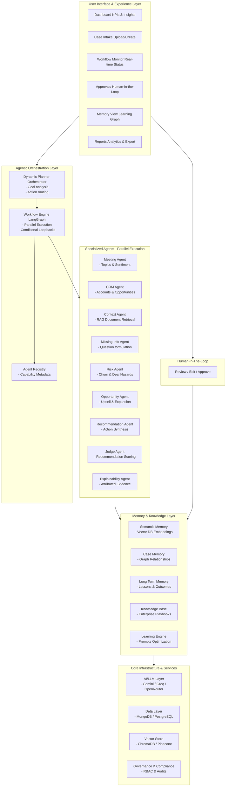

# Conclude One
**Enterprise Decision Intelligence Platform**

Conclude One is a multi-agent orchestration platform that ingests customer meeting transcripts and CRM data, retrieves relevant enterprise playbooks (RAG), evaluates risk factors, and synthesizes actionable executive decisions.

It features a state-of-the-art **LangGraph** orchestration workflow that coordinates specialized AI agents (Meeting, CRM, Context, Risk, Explainability, and Recommendation) to deliver highly contextualized, verifiable business recommendations.

---

## 🎯 Architecture Diagram



---

## 🛠 Technology Stack

### Frontend
- **React.js** with Vite
- **TailwindCSS** for enterprise-grade styling
- **Lucide-React** for unified iconography
- **React Router** for seamless dashboard navigation

### Backend
- **Node.js / Express.js**
- **LangGraph** (JavaScript port) for deterministic multi-agent state machines
- **Google Gemini 1.5 Pro/Flash** (LLM Provider)
- **MongoDB** for state and long-term memory persistence
- **ChromaDB** for vector embeddings and RAG retrieval

## 📂 Folder Structure

```
Conclude-One/
├── client/                     # Frontend Application
│   ├── src/
│   │   ├── components/         # Reusable UI components
│   │   ├── pages/              # Dashboard, Case Detail, etc.
│   │   ├── lib/                # API wrappers and utilities
│   │   └── App.jsx
├── server/                     # Backend Application
│   ├── ai/
│   │   ├── orchestrator/       # LangGraph state machine definitions
│   │   ├── agents/             # Specialized Agent definitions (Meeting, Context, Risk, etc.)
│   │   ├── providers/          # LLM Integration Layer (Gemini, Mock, Factory)
│   │   └── vector/             # ChromaDB client & RAG pipeline
│   ├── models/                 # Mongoose schemas (Case, Memory)
│   ├── routes/                 # Express REST endpoints
│   └── index.js
```

## 🚀 Setup Instructions

### Prerequisites
- Node.js (v18+)
- MongoDB running locally on `mongodb://127.0.0.1:27017`
- ChromaDB running locally on `http://localhost:8000`

### Backend Setup
1. `cd server`
2. `npm install`
3. Create a `.env` file based on `.env.example`:
   ```bash
   GEMINI_API_KEY=your_key_here
   PORT=3005
   MONGO_URI=mongodb://127.0.0.1:27017/conclude_one
   CHROMA_URL=http://localhost:8000
   ```
4. Run the seed script: `npm run seed`
5. Start the backend: `npm run dev`

### Frontend Setup
1. `cd client`
2. `npm install`
3. Start the Vite server: `npm run dev`

## 📊 Demo Flow

For live presentations, Conclude One includes a **Demo Mode Toggle** in the navigation bar.

1. **Activate Demo Mode**: Ensures 100% deterministic, instant responses bypassing LLM rate limits for the presentation.
2. **Dashboard**: View high-level metrics and active orchestrations.
3. **Simulate Webhook**: Trigger a new meeting analysis.
4. **Execution Graph**: Watch LangGraph route the execution path dynamically in real-time.
5. **Case Detail**: Review the finalized Executive Brief, Risk Assessment, and Attributed Evidence.
6. **Human Approval**: Click "Approve Decision" to persist the outcome into the system's Long-Term Memory.

## 🔮 Future Enhancements
- Integration with Salesforce / HubSpot API.
- Live audio transcription websocket ingestion.
- Agent performance analytics and feedback loops.
- Slack integration for asynchronous approvals.
